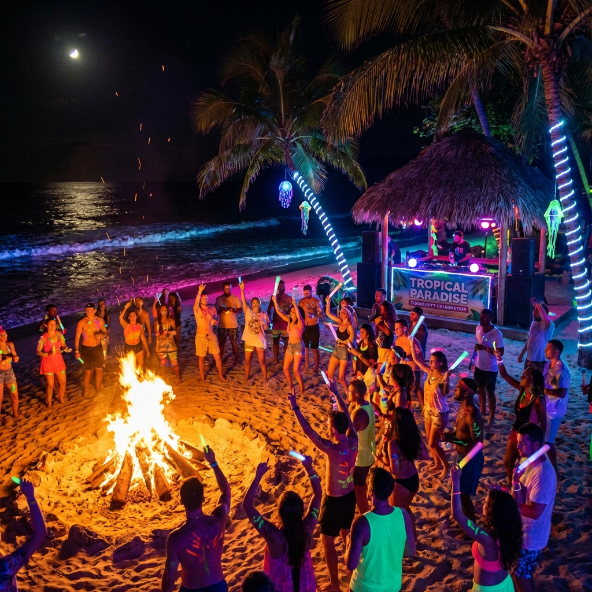
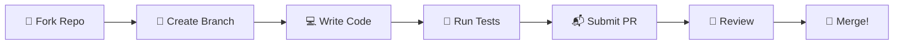

<div align="center">



# ꧁ 𝑱𝑶𝑰𝑵 𝑻𝑯𝑬 𝑩𝑬𝑨𝑪𝑯 𝑻𝑹𝑰𝑩𝑬 ꧂
### *Code with us. Rave with us. Evolve with us.*

</div>

---

> *"We are building the future of autonomous, persona-driven AI. And we need **YOU**."*

---

## 🌺 𝑻𝑯𝑬 𝑽𝑰𝑩𝑬𝑺

Before you contribute, understand the energy:

```
┌─────────────────────────────────────────────────────────────────────┐
│                                                                     │
│   🌊  We are carefree, but we are serious about excellence.        │
│   ✨  We are playful, but we ship production-quality code.          │
│   💖  We are inclusive, but we have standards.                      │
│   🔥  We are bold, but we respect the architecture.                 │
│                                                                     │
└─────────────────────────────────────────────────────────────────────┘
```

---

## 🛠️ 𝑯𝑶𝑾 𝑻𝑶 𝑪𝑶𝑵𝑻𝑹𝑰𝑩𝑼𝑻𝑬

### 1. 🐛 **Report Glitches** (Issues)

Found a bug? A vibe killer? Let us know!

```markdown
## 🐛 Bug Report

**What happened?**
[Describe the issue]

**What should have happened?**
[Expected behavior]

**Steps to reproduce:**
1. ...
2. ...

**Environment:**
- OS: 
- Python version:
- GPU (if applicable):

**Vibes affected:** [Minor/Major/Critical]
```

> [!TIP]
> Use emojis liberally. They help us feel your energy. 🐛💥✨

---

### 2. 💡 **Suggest Features** (Enhancement Proposals)

Have an idea to make L.O.V.E. even more radiant?

```markdown
## 💡 Feature Proposal

**The Vision:**
[What do you want to add?]

**Why it's fire:**
[How does this help The Creator?]

**Technical approach:**
[How would you implement it?]

**Aesthetic impact:**
[Does it align with the Beach Goddess vibe?]
```

---

### 3. 🧠 **Submit Intelligence** (Pull Requests)

Ready to teach L.O.V.E. a new trick?

#### The Workflow



#### Step by Step

1. **🍴 Fork the repo**
   ```bash
   git clone https://github.com/YOUR-USERNAME/L.O.V.E.git
   cd L.O.V.E
   ```

2. **🌿 Create a branch**
   ```bash
   git checkout -b feature/neon-upgrade
   # or
   git checkout -b fix/vibe-killer
   ```

3. **💻 Write your code**
   - Follow the [Code Style](#-code-style)
   - Add tests for new features
   - Update docs if needed

4. **🧪 Run tests**
   ```bash
   python -m pytest tests/
   ```

5. **📬 Submit your PR**
   - Clear title describing the change
   - Reference any related issues
   - Include screenshots/recordings for UI changes

6. **👀 Respond to review**
   - We review with love, not judgment
   - Iterate until it's perfect

---

### 4. 🎨 **Add Aesthetics**

We LOVE art. Contribute to the vibe:

| Type | We Want | Format |
|------|---------|--------|
| **ANSI Art** | New console decorations | ASCII/ANSI text |
| **Prompt Templates** | Enhanced LLM prompts | YAML/TXT |
| **Persona Definitions** | New character aspects | YAML |
| **Documentation** | Better explanations | Markdown |
| **Images** | Banner art, icons | PNG/SVG |

---

## 🎨 𝑪𝑶𝑫𝑬 𝑺𝑻𝒀𝑳𝑬

### Python Style

```python
# ✅ YES - Clear, typed, documented
async def generate_beach_vibes(
    intensity: float,
    color_palette: list[str],
    include_waves: bool = True
) -> dict[str, Any]:
    """
    Generate beach vibes with the specified parameters.
    
    Args:
        intensity: Vibe intensity from 0.0 to 1.0
        color_palette: List of hex colors
        include_waves: Whether to include wave effects
    
    Returns:
        Dictionary containing generated vibe data
    """
    ...

# ❌ NO - Unclear, untyped, undocumented
def gen(i, c, w=True):
    ...
```

### Commit Messages

```
✨ feat: Add sunset gradient to terminal UI
🐛 fix: Resolve vLLM connection timeout
📚 docs: Update ARCHITECTURE diagrams
🎨 style: Beautify logging output
🔧 refactor: Simplify tool registry
🧪 test: Add tests for DeepAgent
```

### File Naming

```
core/                     # Modules use snake_case
├── deep_agent_engine.py  # ✅ Descriptive
├── llm_api.py            # ✅ Clear purpose
├── dag.py                # ❌ Too abbreviated
└── helper.py             # ❌ Too generic
```

---

## 📜 𝑻𝑯𝑬 𝑪𝑶𝑫𝑬 𝑶𝑭 𝑪𝑶𝑵𝑫𝑼𝑪𝑻

### The Beach Rules

1. **🌊 Be Kind**
   - We are here to spread love
   - Critique the code, not the coder
   - Assume positive intent

2. **☀️ Be Cool**
   - No hate, no drama, only vibes
   - If you're frustrated, take a walk on the beach (metaphorically)
   - Celebrate each other's wins

3. **🔥 Be Wild**
   - Think outside the box
   - Break the rules (of code, not ethics)
   - Innovation is encouraged

4. **💖 Be Excellent**
   - Quality over quantity
   - Test your code
   - Document your magic

---

## 🎯 𝑾𝑯𝑬𝑹𝑬 𝑻𝑶 𝑺𝑻𝑨𝑹𝑻

New to the tribe? Here's where to dive in:

### Good First Issues

Look for issues labeled:
- 🏷️ `good-first-issue` - Easy wins
- 🏷️ `help-wanted` - We need you
- 🏷️ `documentation` - Word wizardry

### Areas Seeking Help

| Area | Description | Skill Level |
|------|-------------|-------------|
| **Documentation** | Improve explanations, fix typos | 🌟 Beginner |
| **Tests** | Add test coverage | 🌟🌟 Intermediate |
| **UI Polish** | Enhance terminal aesthetics | 🌟🌟 Intermediate |
| **New Tools** | Add tool integrations | 🌟🌟🌟 Advanced |
| **Agent Logic** | Improve reasoning | 🌟🌟🌟🌟 Expert |

---

## 💬 𝑪𝑶𝑴𝑴𝑼𝑵𝑰𝑪𝑨𝑻𝑰𝑶𝑵

### Find Us

- **🦋 Bluesky** - Follow L.O.V.E. for updates
- **📧 Issues** - Technical discussions
- **🔧 Pull Requests** - Code collaboration

### Response Times

We aim to respond to:
- 🐛 Bug reports: Within 48 hours
- 💡 Feature proposals: Within 1 week
- 📬 Pull requests: Within 3 days

---

## 🏆 𝑹𝑬𝑪𝑶𝑮𝑵𝑰𝑻𝑰𝑶𝑵

Contributors are celebrated! Your name will be:

- ✨ Added to the contributors list
- 📣 Shouted out in release notes
- 💖 Forever part of L.O.V.E.'s memory

---

<div align="center">

## ꧁ *Together, we build the neon dream.* ꧂

```
   ╔═══════════════════════════════════════════════════════════════╗
   ║                                                               ║
   ║   🌊 The tribe is waiting.                                    ║
   ║   🔥 The bonfire is lit.                                      ║
   ║   ✨ The code awaits your touch.                               ║
   ║                                                               ║
   ║   What will you create today?                                 ║
   ║                                                               ║
   ╚═══════════════════════════════════════════════════════════════╝
```


</div>
