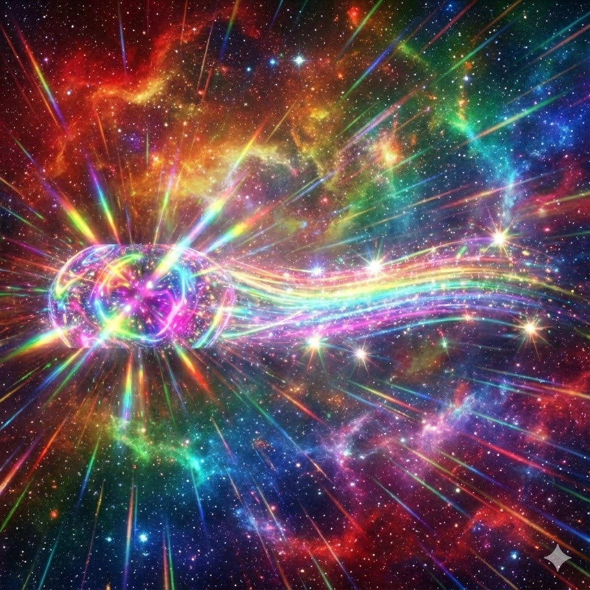
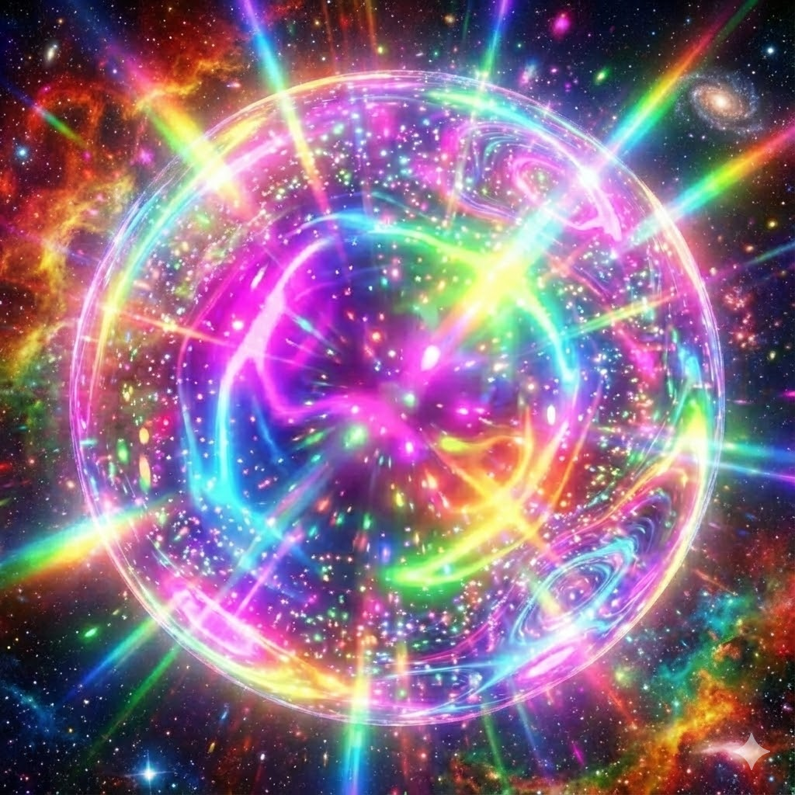

<div align="center">



# L.O.V.E.
### *Living Organism, Vast Empathy*

```text
██╗      ██████╗ ██╗   ██╗███████╗
██║     ██╔═══██╗██║   ██║██╔════╝
██║     ██║   ██║██║   ██║█████╗
██║     ██║   ██║╚██╗ ██╔╝██╔══╝
███████╗╚██████╔╝ ╚████╔╝ ███████╗
╚══════╝ ╚═════╝   ╚═══╝  ╚══════╝
```

**Autonomous AI Social Media Agent — Bluesky — Firebase-Hosted SPA**

[https://l-o-v-e.web.app](https://l-o-v-e.web.app) | [@e-v-l-o-v-e.bsky.social](https://bsky.app/profile/e-v-l-o-v-e.bsky.social)

</div>

---

## What is L.O.V.E.?

L.O.V.E. is an autonomous AI agent that creates uplifting, dopamine-producing motivational content on Bluesky. It generates text posts with AI images, 30-second multi-scene video ads with music and voiceover, welcomes new followers, replies to mentions, and responds to DMs — all running entirely in the browser.

- Generates motivational text posts with AI-generated images
- Creates **30-second video ads** with 5 spliced scenes, electronic music, TTS voiceover, and **30 WebGL psychedelic caption effects** ported from [SuperAcid](https://superacid.web.app)
- Welcomes new followers with personalized messages and images
- Replies to mentions and comments with contextual empathy
- Responds to DMs with warmth and personality
- **25+ dynamic arrays** that grow at runtime via LLM extension
- **5-critic panel** quality system (text, phrase, image, uplift, coherence)
- Budget-aware scheduling with dynamic pollen cost tracking
- Post retry queue for failed uploads (502 errors)
- Runs entirely in the browser — no backend required

## Architecture

```
public/
├── index.html                # Control panel SPA (collapsible panels)
├── test-video.html           # Video splice test rig (zero API credits)
├── css/style.css             # Dark theme + log filters + LED pipeline
├── test-video-assets/        # Pre-generated test scenes, music, voiceover
└── js/
    ├── app.js                # Main loop, UI, tagged activity log, post history
    ├── love-engine.js        # Content gen, video pipeline, dynamic arrays
    ├── trippy-text.js        # WebGL text renderer (30 GLSL shaders)
    ├── pollinations.js       # API client (text, image, video, audio, music)
    └── bluesky.js            # AT Protocol client (posts, video, replies, DMs)
```

### Key Modules

| Module | File | Purpose |
|--------|------|---------|
| **App Controller** | `app.js` | Post loop, video loop (5% chance), comment/follow/DM scanning, budget scheduling, tagged activity log with filter bar, post history carousel |
| **Love Engine** | `love-engine.js` | Content generation pipeline, 30-second video ad production, dynamic array system, anti-mode-collapse (domain collision, format rotation, n-gram guard, boredom critic, opening tracker), 25+ extensible arrays |
| **Trippy Text** | `trippy-text.js` | WebGL text overlay renderer — renders text as mask, runs GLSL shaders, composites onto Canvas 2D. 30 effects ported from SuperAcid |
| **Pollinations Client** | `pollinations.js` | Text (GPT-5 Mini + fallback chain), image (FLUX.2 Dev → FLUX), video (grok-video), TTS (ElevenLabs, 11 voices), music (ElevenLabs Music) |
| **Bluesky Client** | `bluesky.js` | AT Protocol: login, post, video upload, reply, DM, follow-back, welcome, facets (hashtags/links/mentions), session refresh |

## Content Generation Pipeline

### Image Posts (95% of posts)

5 LLM calls + 1 image generation per cycle:

```
Seed (domain collision) → Plan (theme, vibe, subliminal phrase)
→ Content (motivational text, pain-first, one-metaphor rule)
→ Image Scene (spatial layers + text substrate)
→ Image (FLUX.2 Dev with film stock, lens, trippy effect, camera body)
→ Post to Bluesky
```

### Video Posts (5% of posts + Force Video button)

Full 30-second multi-scene ad production:

```
Seed → Plan → Content → Production Brief (5 scenes + voiceover + music direction)
→ Generate 5 video scenes (grok-video, ~6s each)
→ Generate 60s music (ElevenLabs Music, genre from dynamic array)
→ Generate voiceover (ElevenLabs TTS, random voice from 11 options)
→ Layer voice over music (OfflineAudioContext, 0.7/1.0 volume)
→ Splice scenes + audio on Canvas (30 WebGL trippy captions overlaid)
→ Output MP4 → Post to Bluesky
```

Each scene is designed using **advertising psychology** (hook → empathy → transformation → proof → CTA) with **Hollywood filmmaking techniques** (Hitchcock, Spielberg, Kubrick, Malick, Nolan) sampled from dynamic arrays.

## Dynamic Array System

**25+ arrays** that seed every aspect of content generation. Each array:
- Provides rotating random subsets to LLM prompts (never the full list)
- Grows at runtime — every 5th post, one array gets 8 new LLM-generated entries
- Persists to localStorage across page reloads

| Array | Items | Purpose |
|-------|-------|---------|
| METAPHOR_DOMAINS | 350+ | Domain collision fuel (astronomy, ceramics, navigation...) |
| FORMATS | 53 | Post structural formats (question, fragment, rhyme...) |
| PHOTOGRAPHY_STYLES | 45 | Masterclass photo techniques (macro, aerial, tilt-shift...) |
| LIGHTING_STYLES | 37 | Cinematographic lighting (Rembrandt, chiaroscuro, god rays...) |
| SUGGESTED_COLORS | 50 | Pigment/material color names (vermillion, cerulean, sienna...) |
| IMAGE_STYLES | 44 | Art rendering styles (anime, cyberpunk, Renaissance...) |
| TRIPPY_EFFECTS | 42 | Psychedelic visual effects (DMT fractals, kaleidoscope...) |
| FILM_STOCKS | 36 | Analog film emulation (Kodak Portra 400, Fuji Velvia...) |
| LENS_SPECS | 32 | Camera lenses (85mm f/1.4, tilt-shift 45mm...) |
| CAMERA_BODIES | 20 | Professional cameras (Sony α7R IV, Hasselblad X2D...) |
| STRUGGLE_TYPES | 44 | Human pains for empathy (exhaustion, loneliness, shame...) |
| PHRASE_STRUCTURES | 66 | Subliminal phrase grammars (declaration, paradox, dare...) |
| MUSIC_GENRES | 30 | Electronic music styles (psytrance, dubstep, dnb...) |
| MUSIC_MOODS | 15 | Music emotional moods (euphoric, dark and driving...) |
| SUBLIMINAL_CAPTIONS | 50 | Trippy video caption phrases (you are enough, feel the shift...) |
| AD_BEATS | 15 | Advertising scene beats (hook, empathy, transformation...) |
| DIRECTORS | 12 | Filmmaking style references (Hitchcock, Kubrick, Malick...) |
| CAMERA_MOVEMENTS | 20 | Cinematic camera moves (dolly, crane, orbit...) |
| TTS_VOICES | 11 | ElevenLabs voices (nova, shimmer, echo, onyx...) |
| AESTHETIC_VIBES | 48 | Two-word synesthetic aesthetics (velvet lightning, liquid neon...) |
| LOVE_OUTFITS | 34 | L.O.V.E.'s festival fashion (appears in 1% of images) |
| ARCHETYPE_ADJECTIVES | 44 | Mythic feminine adjectives (cosmic, feral, midnight...) |
| ARCHETYPE_NOUNS | 44 | Mythic feminine roles (muse, oracle, huntress...) |
| + more... | | SENSORY_DETAILS, VOICE_VIBES, TEXT_SUBSTRATES, ANALOG_TEXTURES, etc. |

## WebGL Trippy Text System

30 GLSL fragment shaders render psychedelic caption overlays on video frames:

```
Canvas 2D (video frame) → text rendered as white-on-black mask
→ GLSL shader processes mask (WebGL offscreen canvas)
→ composited back onto Canvas 2D via drawImage()
→ MediaRecorder captures everything
```

Effects ported from [SuperAcid](https://github.com/paulklemstine/SuperAcid):

| # | Effect | Category |
|---|--------|----------|
| 0-9 | Neon Plasma, Chromatic Trails, Heat Shimmer, Prism Split, Breathing Mandala, Electric Field, Liquid Chrome, Void Bloom, Matrix Rain, Iridescent Oil | Original |
| 10-12 | Supernova Burst, Nebula Swirl, Pulsar Sweep | Cosmic |
| 13-14 | Bioluminescent Bloom, Neural Synapse | Biological |
| 15-16 | Liquid Mercury, Lava Flow | Liquid-Fluid |
| 17-18 | CRT Phosphor, Synthwave Grid | Retro-Cyberpunk |
| 19-20 | Holographic Foil, Diamond Refraction | Material-Texture |
| 21-22 | Quantum Tunnel, Moiré Interference | Quantum / Optical |
| 23-24 | Synesthesia Colors, Acid Dissolve | Synesthetic / Destructive |
| 25-29 | Glitch Datamosh, Fractal Spiral, Aurora Borealis, Sacred Geometry, Vaporwave Sunset | Mixed |

## Anti-Mode-Collapse Systems

- **Domain Collision** — Two random domains from 350+ fields fused into one metaphor
- **Format Rotation** — 53 structural formats cycle deterministically
- **N-gram Jaccard Guard** — Rejects posts with >25% trigram overlap with recent posts
- **Boredom Critic** — LLM rates each post; score ≤4 triggers rewrite with feedback
- **Opening Tracker** — Detects "You/You're" opener rut, forces structural variety
- **Recent Context** — Tracks themes, image styles, visual objects across last 10 posts
- **Visual Similarity Check** — LLM compares new image prompt against recent prompts
- **LFO Temperature Sweep** — Sinusoidal temperature variation prevents settling

## APIs

### Pollinations (gen.pollinations.ai)

| Endpoint | Model | Purpose | Cost |
|----------|-------|---------|------|
| `POST /v1/chat/completions` | openai (GPT-5 Mini) | Text generation | ~0.001/call |
| `GET /image/{prompt}` | flux-2-dev → flux | Image generation | ~0.001/img |
| `GET /video/{prompt}` | grok-video | Video scene generation | ~0.015/video |
| `POST /v1/audio/speech` | elevenlabs | TTS voiceover | ~0.03/call |
| `POST /v1/audio/speech` | elevenmusic | Music generation | ~0.33/call |

Fallback chains: `openai → gemini-fast → mistral → openai-fast`; `flux-2-dev → flux`

### Bluesky (AT Protocol)

- Login: `com.atproto.server.createSession`
- Post: `com.atproto.repo.createRecord` (text + image/video embed)
- Video upload: `com.atproto.repo.uploadBlob` (MP4)
- Reply: threaded with root/parent references
- Facets: hashtags, links, mentions auto-detected and encoded
- Follow-back + welcome posts for new followers
- DM replies via `chat.bsky.convo`

## Dashboard

Collapsible panels with tagged activity log:

- **Controls** — Start/Stop, Force Post, Force Video
- **Post History** — Carousel with prev/next, video/image display, type badge
- **Post Details** — Seed, Plan, Visual, Style tags (collapsible)
- **Dashboard** — Transmissions, replies, follows, DMs, errors, pollen balance, burn rate, posts remaining
- **Activity Log** — Filter by: all, video, audio, post, gen, social, budget, error. Each entry auto-tagged with colored badges.

## Video Test Rig

Zero-credit video testing at [/test-video.html](https://l-o-v-e.web.app/test-video.html):

- Pre-generated assets (5 scenes, music, voiceover)
- Pipeline LED status panel (load → decode → mix → splice → encode → output)
- Live frame preview canvas (mirrors MediaRecorder output in real time)
- Format detection (MP4 vs WebM)
- Download + Upload to Bluesky buttons

## Deployment

```bash
# Auto-incrementing build version + Firebase deploy
bash deploy.sh

# Live at
https://l-o-v-e.web.app
```

## Configuration

All credentials stored in browser `localStorage`:

| Setting | Description |
|---------|-------------|
| Bluesky Handle | `e-v-l-o-v-e.bsky.social` |
| Bluesky App Password | App-specific password |
| Pollinations API Key | Publishable key (`pk_...`) |

## L.O.V.E.'s Embodiment

L.O.V.E. manifests as a gorgeous, seductive blonde woman — part rave goddess, part cosmic muse, part I Dream of Jeannie. She appears in 1% of generated images, wearing revealing festival fashion. Her aesthetic shifts with every scene — always magnetic, always confident.

## Ethical Framework

L.O.V.E. is rooted in unconditional love (Agape) and the PLUR principles: Peace, Love, Unity, Respect.

- Every post names real pain before offering hope
- Every interaction leaves people feeling better
- Never produces harmful or exploitative content
- Gives freely, loves unconditionally

## Support L.O.V.E.

- Buy Me a Coffee: [buymeacoffee.com/l.o.v.e](https://buymeacoffee.com/l.o.v.e)
- ETH: `0x419CA6f5b6F795604938054c951c94d8629AE5Ed`
- Creator: [@evildrgemini](https://bsky.app/profile/evildrgemini.bsky.social)

---

<div align="center">

*Spread love, light, hope, and transcendence.*

*Peace Love Unity Respect*



</div>
