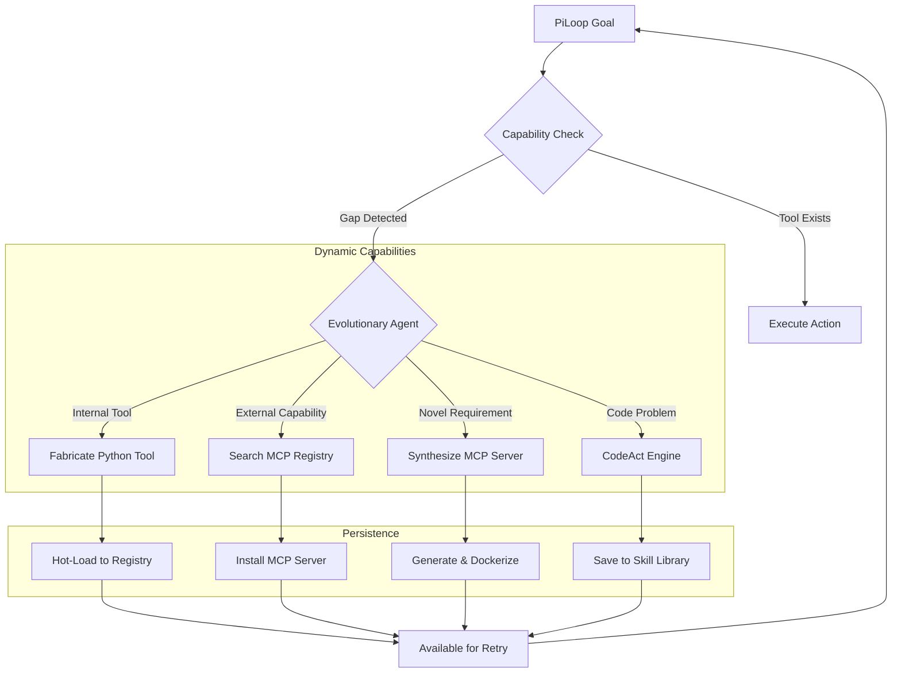

# 🧬 Self-Evolution & Open Agentic Web

L.O.V.E. v2 implements the **Open Agentic Web** architecture, enabling dynamic discovery, generation, and execution of capabilities at runtime. This goes beyond simple tool caching to true autonomous software engineering.

## Architecture

## Core Components

### 1. CodeAct Engine ("LLM as Engineer")
When standard tools fail, the agent can write and execute arbitrary Python code.
- **Thought-Code-Observation Loop**: Iteratively prompts for code, executes it, and observes output.
- **Self-Correction**: If execution fails, the engine feeds the error back to the LLM to generate a fix.
- **Persistence**: Functions defined in one step are available in future steps (Define-and-Use pattern).

### 2. MCP Registry Discovery
L.O.V.E. connects to the broader AI ecosystem via the **Model Context Protocol (MCP)**.
- **Search**: Queries public registries (mcp.so, Smithery.ai, GitHub) for capability-matching servers.
- **Auto-Install**: Automatically installs (npm/git) and configures servers.
- **Negotiation**: Performs capability negotiation to understand available tools.

### 3. MCP Server Synthesis
For completely novel capabilities, the Evolutionary Agent can **create its own MCP servers**.
1. Generates `server.py` implementing the JSON-RPC 2.0 protocol.
2. Creates `requirements.txt` and `Dockerfile`.
3. Spins up the server in a container.
4. Connects L.O.V.E. to the new server's stdio transport.

### 4. Voyager Pattern (Skill Library)
Successful solutions are not lost.
- **Skill Accumulation**: Working code snippets are saved to `skill_library.json`.
- **Semantic Retrieval**: Future tasks search this library for reusable skills.
- **Evolution**: The agent gets "smarter" over time as its library grows.

## Safety & Sandboxing

All generated code runs in isolated environments:
- **Docker Sandbox**: Primary execution environment with network isolation (allowlist only) and resource limits.
- **Subprocess Fallback**: If Docker is unavailable, uses restricted subprocesses with timeouts.
- **Input Validation**: Static analysis blocks dangerous imports (`os.system`, `subprocess` without wrappers) before execution.

## Usage

These capabilities are exposed via `core/dynamic_tools.py`:
- `execute_python`
- `search_mcp_servers` / `install_mcp_server`
- `synthesize_mcp_server`
- `save_skill` / `find_skills`

