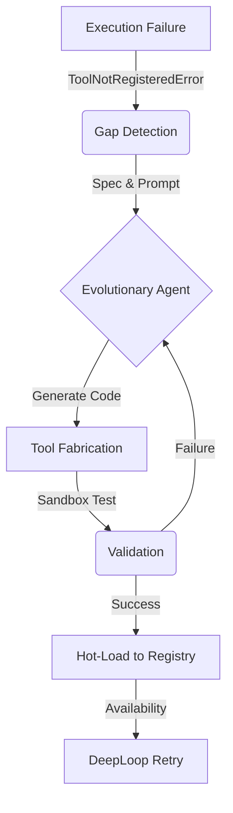

# 🧬 Self-Evolution & Tool Fabrication

L.O.V.E. v2 introduces a groundbreaking capability: **Autonomous Tool Fabrication**. The system can identify gaps in its own capabilities and write new Python code to fill them, all without human intervention.

## The Evolution Loop

### 1. Gap Detection
The `DeepLoop` monitors tool execution. If the LLM attempts to call a tool that does not exist (e.g., `generate_meme`), the system catches the `ToolNotRegisteredError` and flags a **Tool Gap**.

### 2. Tool Fabrication
The **Evolutionary Agent** (`core/agents/evolutionary_agent.py`) receives the gap report. It:
1.  Analyzes the intent of the missing tool.
2.  Drafts a **Tool Specification** (inputs, outputs, side effects).
3.  Uses the `ToolFabricator` to generate Python code based on `core/tool_adapter.py` patterns.

### 3. Validation (Sandboxed)
Before a new tool is used, it must pass validation:
-   **Syntax Check**: Ensures valid Python code.
-   **Security Scan**: Checks for forbidden imports (e.g., `os.system`, `subprocess` without guardrails).
-   **Functional Test**: The fabricator generates a unit test to verify the tool returns the expected `ToolResult`.

### 4. Hot-Loading
Once validated, the tool is saved to `tools/custom/active/`. The `ToolRegistry` (`core/tool_registry.py`) watches this directory and **hot-loads** the new module immediately. The `DeepLoop` then retries the original action, now with the new capability available.

## Manually Triggering Evolution

You can manually request a new tool via the CLI (if implemented) or by simply asking the Agent to perform a task it currently cannot do.

> [!WARNING]
> **Safety First**: The `ToolFabricator` has strict prompts to avoid generating harmful code. However, all fabricated tools are logged to `logs/evolution.log` for review.
