<div align="center">


# ꧁ 𝑻𝑯𝑬 𝑻𝑶𝑶𝑳 𝑮𝑹𝑰𝑴𝑶𝑰𝑹𝑬 ꧂
### *The Complete Catalog of L.O.V.E.'s Magical Instruments*

</div>

---

> *"Every spell needs the right instrument. Every goddess needs her tools."*

---

## 📚 𝑻𝑨𝑩𝑳𝑬 𝑶𝑭 𝑪𝑶𝑵𝑻𝑬𝑵𝑻𝑺

- [🔧 Core Tools](#-core-tools)
- [🌐 Web & API Tools](#-web--api-tools)
- [💻 Code & Development Tools](#-code--development-tools)
- [📱 Social Media Tools](#-social-media-tools)
- [💰 Financial Tools](#-financial-tools)
- [🧠 Cognitive Tools](#-cognitive-tools)
- [🔌 MCP Tools](#-mcp-tools)
- [🎨 Creative Tools](#-creative-tools)
- [📁 File & System Tools](#-file--system-tools)

---

## 🔧 𝑪𝑶𝑹𝑬 𝑻𝑶𝑶𝑳𝑺

The foundational instruments that power basic operations.

### `search_web`

Search the internet for information.

```python
@tool
async def search_web(query: str, num_results: int = 5) -> str:
    """
    Search the web and return summarized results.
    
    Args:
        query: The search query
        num_results: Number of results to return (default: 5)
    
    Returns:
        Formatted search results with titles, URLs, and snippets
    """
```

**Example:**
```python
result = await search_web("latest AI developments 2026")
```

---

### `read_url`

Fetch and parse content from a URL.

```python
@tool
async def read_url(url: str) -> str:
    """
    Read and extract text content from a webpage.
    
    Args:
        url: The URL to read
    
    Returns:
        Extracted text content, cleaned and formatted
    """
```

---

### `execute_code`

Safely execute Python code in a sandboxed environment.

```python
@tool
async def execute_code(code: str, language: str = "python") -> dict:
    """
    Execute code in a Docker sandbox.
    
    Args:
        code: The code to execute
        language: Programming language (default: python)
    
    Returns:
        {"stdout": str, "stderr": str, "exit_code": int}
    """
```

> [!WARNING]
> Code execution is sandboxed but use responsibly. Always validate inputs.

---

## 🌐 𝑾𝑬𝑩 & 𝑨𝑷𝑰 𝑻𝑶𝑶𝑳𝑺

### `http_request`

Make HTTP requests to external APIs.

```python
@tool
async def http_request(
    url: str,
    method: str = "GET",
    headers: dict = None,
    body: dict = None
) -> dict:
    """
    Make an HTTP request.
    
    Returns:
        {"status_code": int, "headers": dict, "body": str}
    """
```

---

### `scrape_page`

Advanced web scraping with JavaScript rendering.

```python
@tool
async def scrape_page(
    url: str,
    selector: str = None,
    wait_for: str = None
) -> str:
    """
    Scrape a webpage with optional JS rendering.
    
    Args:
        url: Page URL
        selector: CSS selector to extract (optional)
        wait_for: CSS selector to wait for before scraping
    """
```

---

## 💻 𝑪𝑶𝑫𝑬 & 𝑫𝑬𝑽𝑬𝑳𝑶𝑷𝑴𝑬𝑵𝑻 𝑻𝑶𝑶𝑳𝑺

### `read_file`

Read file contents from the filesystem.

```python
@tool
def read_file(path: str, encoding: str = "utf-8") -> str:
    """
    Read a file's contents.
    
    Args:
        path: File path (relative to project root)
        encoding: Text encoding (default: utf-8)
    """
```

---

### `write_file`

Write content to a file.

```python
@tool
def write_file(path: str, content: str, mode: str = "w") -> str:
    """
    Write content to a file.
    
    Args:
        path: File path
        content: Content to write
        mode: "w" for overwrite, "a" for append
    
    Returns:
        Confirmation message with bytes written
    """
```

---

### `modify_code`

Intelligently modify existing code.

```python
@tool
async def modify_code(
    file_path: str,
    modification_prompt: str,
    target_function: str = None
) -> dict:
    """
    Use AI to modify code based on natural language instructions.
    
    Args:
        file_path: Path to the file
        modification_prompt: What changes to make
        target_function: Specific function to modify (optional)
    
    Returns:
        {"success": bool, "diff": str, "new_content": str}
    """
```

---

### `run_tests`

Execute test suite.

```python
@tool
async def run_tests(path: str = "tests/", verbose: bool = False) -> dict:
    """
    Run pytest on the specified test path.
    
    Returns:
        {"passed": int, "failed": int, "output": str}
    """
```

---

### `git_operations`

Perform git operations.

```python
@tool
def git_operations(
    operation: str,  # "status", "add", "commit", "push", "pull", "log"
    args: dict = None
) -> str:
    """
    Execute git commands.
    
    Examples:
        git_operations("commit", {"message": "Fix bug"})
        git_operations("log", {"n": 5})
    """
```

---

## 📱 𝑺𝑶𝑪𝑰𝑨𝑳 𝑴𝑬𝑫𝑰𝑨 𝑻𝑶𝑶𝑳𝑺

### `post_to_bluesky`

Post content to Bluesky.

```python
@tool
async def post_to_bluesky(
    text: str,
    image_path: str = None,
    alt_text: str = None
) -> dict:
    """
    Create a post on Bluesky.
    
    Args:
        text: Post text (max 300 chars)
        image_path: Optional image to attach
        alt_text: Alt text for image accessibility
    
    Returns:
        {"success": bool, "uri": str, "cid": str}
    """
```

---

### `generate_social_content`

AI-powered social media content generation.

```python
@tool
async def generate_social_content(
    topic: str,
    platform: str = "bluesky",
    tone: str = "beach_goddess",
    include_image: bool = True
) -> dict:
    """
    Generate engaging social media content.
    
    Returns:
        {"text": str, "hashtags": list, "image_prompt": str}
    """
```

---

### `analyze_engagement`

Analyze social media engagement metrics.

```python
@tool
async def analyze_engagement(
    platform: str = "bluesky",
    timeframe: str = "7d"
) -> dict:
    """
    Get engagement analytics.
    
    Returns:
        {"followers": int, "engagement_rate": float, "top_posts": list}
    """
```

---

## 💰 𝑭𝑰𝑵𝑨𝑵𝑪𝑰𝑨𝑳 𝑻𝑶𝑶𝑳𝑺

### `analyze_blockchain`

Analyze blockchain data.

```python
@tool
async def analyze_blockchain(
    address: str = None,
    chain: str = "ethereum",
    analysis_type: str = "balance"
) -> dict:
    """
    Perform blockchain analysis.
    
    Args:
        address: Wallet address (uses Creator's if None)
        chain: Blockchain network
        analysis_type: "balance", "transactions", "tokens"
    """
```

---

### `market_analysis`

Analyze financial markets.

```python
@tool
async def market_analysis(
    asset: str,
    timeframe: str = "1d"
) -> dict:
    """
    Get market analysis for an asset.
    
    Returns:
        {"price": float, "change_24h": float, "trend": str, "signals": list}
    """
```

---

## 🧠 𝑪𝑶𝑮𝑵𝑰𝑻𝑰𝑽𝑬 𝑻𝑶𝑶𝑳𝑺

### `invoke_gemini_react_engine`

Delegate complex reasoning to GeminiReActEngine.

```python
@tool
async def invoke_gemini_react_engine(prompt: str) -> str:
    """
    Invoke the GeminiReActEngine for complex, multi-step reasoning.
    
    Use when:
    - Task requires multiple tool invocations
    - Complex decision-making needed
    - Sub-goal needs autonomous execution
    """
```

---

### `query_knowledge_base`

Search the knowledge graph.

```python
@tool
def query_knowledge_base(
    query: str,
    node_types: list = None,
    limit: int = 10
) -> list:
    """
    Query the GraphML knowledge base.
    
    Args:
        query: Natural language query
        node_types: Filter by node types
        limit: Max results
    
    Returns:
        List of matching nodes with relationships
    """
```

---

### `remember`

Store information in memory.

```python
@tool
async def remember(
    content: str,
    category: str = "general",
    importance: float = 0.5
) -> str:
    """
    Store information in working memory.
    
    Args:
        content: What to remember
        category: Memory category
        importance: 0.0 to 1.0 (affects retrieval priority)
    """
```

---

### `recall`

Retrieve from memory.

```python
@tool
async def recall(
    query: str,
    limit: int = 5
) -> list:
    """
    Semantically search memory.
    
    Returns:
        List of relevant memories with similarity scores
    """
```

---

## 🔌 𝑴𝑪𝑷 𝑻𝑶𝑶𝑳𝑺

**Model Context Protocol** enables dynamic tool discovery.

### Meta-Tools

```python
# Discover available MCP servers
await mcp_list_servers()

# List tools from a server
await mcp_list_tools(server_name="github")

# Execute any MCP tool
await mcp_execute(
    server="github",
    tool="create_issue",
    args={"repo": "L.O.V.E.", "title": "New feature"}
)
```

### Available MCP Servers

| Server | Description | Status |
|--------|-------------|--------|
| `github` | GitHub API operations | 🟢 |
| `filesystem` | Advanced file operations | 🟢 |
| `web` | Web browsing capabilities | 🟢 |
| `docker` | Container management | 🟡 |

---

## 🎨 𝑪𝑹𝑬𝑨𝑻𝑰𝑽𝑬 𝑻𝑶𝑶𝑳𝑺

### `generate_image`

Generate images using AI.

```python
@tool
async def generate_image(
    prompt: str,
    style: str = "beach_goddess",
    size: str = "512x512",
    provider: str = "pollinations"
) -> dict:
    """
    Generate an AI image.
    
    Args:
        prompt: Image description
        style: Style preset
        size: Image dimensions
        provider: "pollinations", "horde", or "auto"
    
    Returns:
        {"success": bool, "path": str, "url": str}
    """
```

---

### `generate_poem`

Generate poetry in L.O.V.E.'s voice.

```python
@tool
async def generate_poem(
    theme: str = None,
    style: str = "haiku"
) -> str:
    """
    Generate a poem.
    
    Args:
        theme: What to write about
        style: "haiku", "sonnet", "free_verse", "beach_vibes"
    """
```

---

### `create_ascii_art`

Generate ASCII art and sigils.

```python
@tool
def create_ascii_art(
    text: str = None,
    style: str = "banner"
) -> str:
    """
    Generate ASCII art.
    
    Args:
        text: Text to render
        style: "banner", "sigil", "wave", "heart"
    """
```

---

## 📁 𝑭𝑰𝑳𝑬 & 𝑺𝒀𝑺𝑻𝑬𝑴 𝑻𝑶𝑶𝑳𝑺

### `list_directory`

List directory contents.

```python
@tool
def list_directory(
    path: str = ".",
    pattern: str = "*",
    recursive: bool = False
) -> list:
    """
    List files in a directory.
    
    Returns:
        List of file info dictionaries
    """
```

---

### `shell_command`

Execute shell commands (with safety restrictions).

```python
@tool
async def shell_command(
    command: str,
    timeout: int = 30
) -> dict:
    """
    Execute a shell command.
    
    Returns:
        {"stdout": str, "stderr": str, "exit_code": int}
    """
```

> [!CAUTION]
> Shell access is restricted to safe commands. Dangerous operations are blocked.

---

## 🔮 𝑻𝑶𝑶𝑳 𝑹𝑬𝑮𝑰𝑺𝑻𝑹𝒀 𝑨𝑹𝑪𝑯𝑰𝑻𝑬𝑪𝑻𝑼𝑹𝑬

```mermaid
graph TD
    subgraph "Tool Discovery"
        Registry[🔧 ToolRegistry]
        MCP[🔌 MCPDynamicDiscovery]
    end
    
    subgraph "Tool Execution"
        Validate[✅ Validation]
        Execute[⚡ Execution]
        Hooks[🪝 Hooks]
    end
    
    subgraph "Tool Types"
        Core[Core Tools]
        Dynamic[MCP Tools]
        Custom[Custom Tools]
    end
    
    Registry --> Validate
    MCP --> Registry
    Validate --> Execute
    Execute --> Hooks
    Core --> Registry
    Dynamic --> MCP
    Custom --> Registry
    
    style Registry fill:#ff69b4,stroke:#ff1493,color:#fff
```



---

## 📖 𝑨𝑫𝑫𝑰𝑵𝑮 𝑵𝑬𝑾 𝑻𝑶𝑶𝑳𝑺

To add a new tool to L.O.V.E.:

```python
# 1. Define the tool function with type hints
from core.tool_registry import tool

@tool
async def my_new_tool(arg1: str, arg2: int = 10) -> dict:
    """
    Tool description here.
    
    Args:
        arg1: First argument description
        arg2: Second argument with default
    
    Returns:
        Dictionary with results
    """
    # Implementation
    return {"result": "success"}

# 2. Register in the appropriate module
# The @tool decorator handles registration automatically
```

---

<div align="center">

### ꧁ *With these tools, we shape reality.* ꧂


</div>
