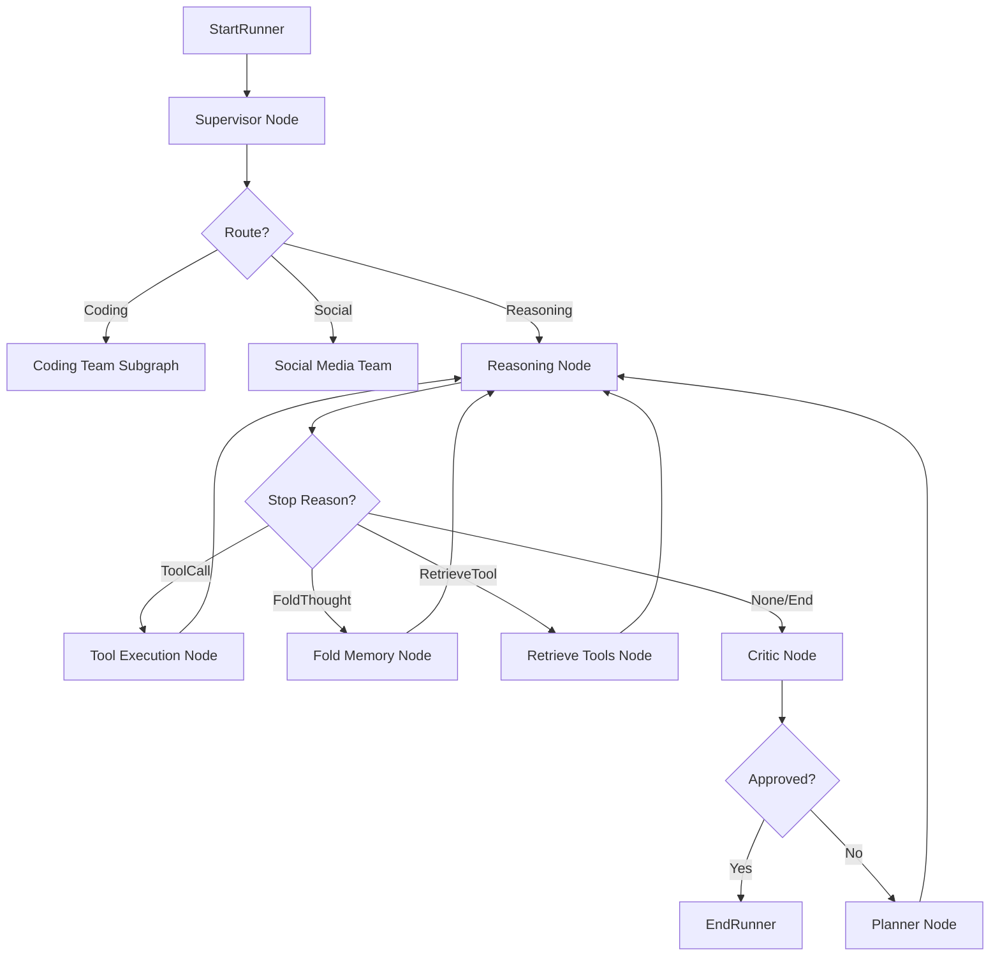

# Cognitive Process Map: L.O.V.E. System

This document maps the internal cognitive processes of the L.O.V.E. system, identifying decision-making pathways, reasoning chains, and response generation steps.

## High-Level Architecture

The system operates as a continuous cognitive loop, orchestrating various agents and processing inputs from multiple sources (User, Internal, Scheduled).

### 1. Input Sources & Triggers

*   **User Input (Creator Mandate)**:
    *   **Source**: WebSocket (`user_input_queue`).
    *   **Priority**: Highest. Interrupts autonomous tasks.
    *   **Handling**: `cognitive_loop` in `love.py`.

*   **Autonomous Strategic Planning**:
    *   **Source**: `AutonomousReasoningAgent` (runs every 120s).
    *   **Mechanism**: `StrategicReasoningEngine` generates a plan (list of steps).
    *   **Action**: Pushes tasks (strings) to `user_input_queue`.

*   **Internal Backlog / Intrinsic Motivation**:
    *   **Source**: `GoalGeneratorAgent` or `CuriosityAgent`.
    *   **Mechanism**: Runs when `user_input_queue` is empty.
    *   **Action**: `_prioritize_and_select_task` selects from backlog.

### 2. The Cognitive Loop (`love.py`)

The `cognitive_loop` function is the central executive.

```mermaid
graph TD
    Start[Loop Start] --> CheckQueue{User Input Queue Empty?}

    CheckQueue -- No --> HandleInput[Handle Creator Mandate]
    HandleInput --> TheoryOfMind[Inject User Model Context]
    HandleInput --> RunAgent[DeepAgentRunner.run]
    RunAgent --> Superego[Superego Check (safe_output)]
    Superego --> UpdateUserModel[Update User Model (Async)]
    UpdateUserModel --> Memory[Record to Episodic Memory]
    Memory --> LoopEnd

    CheckQueue -- Yes --> SelectTask[Autonomous Task Selection]
    SelectTask --> Prioritize[_prioritize_and_select_task]
    Prioritize --> LLM_Score[LLM: Score Candidates]
    LLM_Score --> PickTask{Task Selected?}

    PickTask -- Yes --> ExecuteTask[Execute Task]
    ExecuteTask --> CheckSource{Source?}
    CheckSource -- SelfImprovement --> SelfOptimizer[SelfImprovingOptimizer]
    CheckSource -- ErrorCorrection --> RunAgentErr[DeepAgentRunner (Error Prompt)]
    CheckSource -- Intrinsic --> RunAgentInt[DeepAgentRunner (Goal Prompt)]

    RunAgentErr --> SuperegoTask
    RunAgentInt --> SuperegoTask
    SuperegoTask --> MemoryTask[Ingest Cognitive Cycle]
    MemoryTask --> LoopEnd

    PickTask -- No --> IdleState[Idle State]
    IdleState --> GoalGen[Goal Generator]
    IdleState --> Curiosity[Curiosity Agent]
    Curiosity --> LoopEnd

    LoopEnd --> Start
```

### 3. DeepAgent Execution (`core/runner.py` & `core/graph.py`)

The `DeepAgentRunner` executes the logic for a specific task or input.



### 4. Empathy & Personality (`love.py` Background Threads)

*   **Tamagotchi Thread**:
    *   Runs in background (`update_tamagotchi_personality`).
    *   Analyzes Creator Sentiment periodically.
    *   Updates `tamagotchi_state` (Emotion, Message).
    *   **Inefficiency**: This state is displayed in UI but not deeply integrated into the `DeepAgentRunner`'s reasoning context, other than via `user_model_context` which is updated separately.

### 5. Identified Inefficiencies

1.  **Redundant User Modeling for Internal Tasks**:
    *   `AutonomousReasoningAgent` pushes tasks to `user_input_queue`.
    *   `cognitive_loop` treats *everything* from that queue as a "Creator Mandate".
    *   It triggers `user_modeling_agent.update_from_interaction`, potentially corrupting the user model with internal system monologues or tasks.

2.  **Excessive Prioritization Calls**:
    *   `_prioritize_and_select_task` calls the LLM (`run_llm`) on every loop cycle if tasks exist, to score them.
    *   This is slow and expensive. Priorities likely don't change that fast.

3.  **Disconnected Empathy**:
    *   Sentiment analysis happens in the background, but the `DeepAgentRunner` doesn't explicitly receive the current "Emotional State" (e.g., "I am feeling loving/concerned") as a strong system prompt directive, leading to potentially generic responses.

4.  **String-based Queue**:
    *   `user_input_queue` only accepts strings, making it hard to pass metadata (source, priority, context) along with the input.

## Optimization Plan

1.  **Task Prioritization Caching**: Cache task scores in `_prioritize_and_select_task`.
2.  **Context-Aware Empathy**: Inject `tamagotchi_state` directly into `DeepAgentRunner` state.
3.  **Differentiate Inputs**: Upgrade `user_input_queue` to handle structured objects (Input + Metadata).
